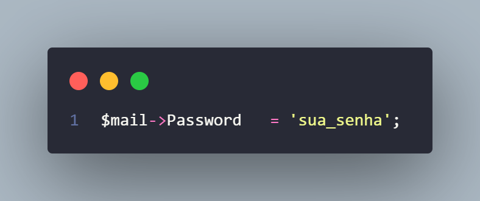
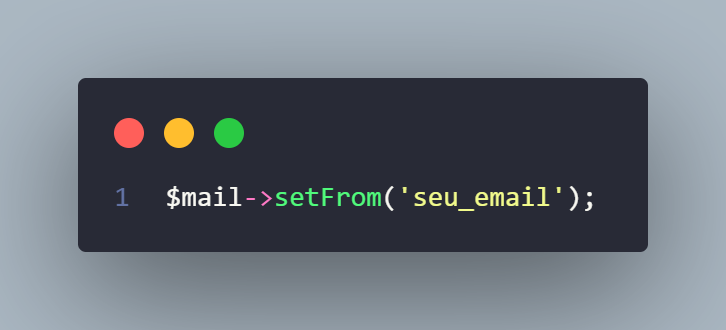
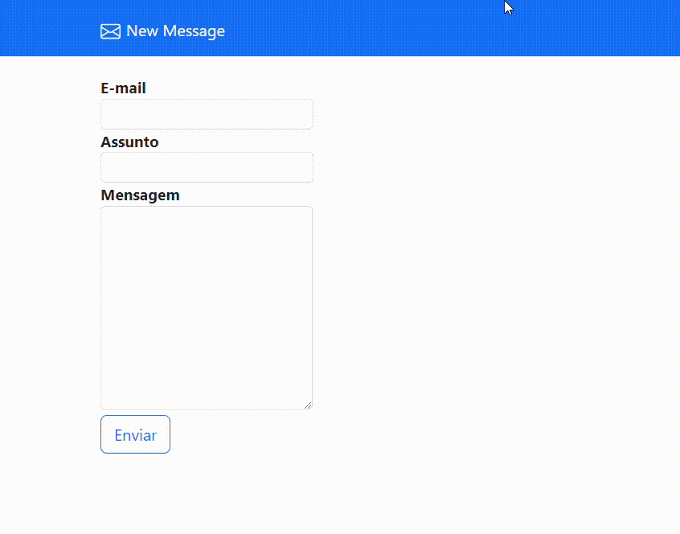
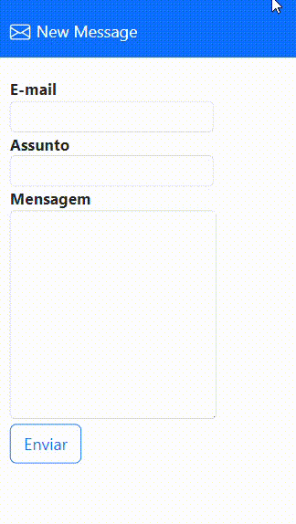

     <h1>Send Mail</h1>

## Data

    28/04/2024 , Fortaleza - CE

## Descrição

   Send Mail é um código que envia emails. Você precisa adicionar o email, assunto e a mensagem que deseja enviar. Ele utiliza HTML/CSS, Bootstrap, JavaScript, PHP e o PHPMailer (API).  OBS: Para o código funcionar, você precisa inserir sua conta de email (Gmail).

## Passo a Passo
- 1° Passo
    
Acesse o arquivo "email_validacao.php"

- 2° Passo
      
    
    
Adicione o seu e-mail

      

    
    
Adicione a sua senha

      
- 3° Passo
      
    
    
Adicione o e-mail, que vai enviar os emails

## Funcionalidade
- Enviar Email

## Imagens do Projeto
- PC   

  
- MOBILE   

## Autor
@KaueNunez

## Agradecimentos
- Jorge Sant Ana
- Curso : Desenvolvimento Web Completo - 20 cursos + 20 projetos
  

    <h1>KaueNunez - 👨🏻‍💻 + ☕ = < / ></h1>

